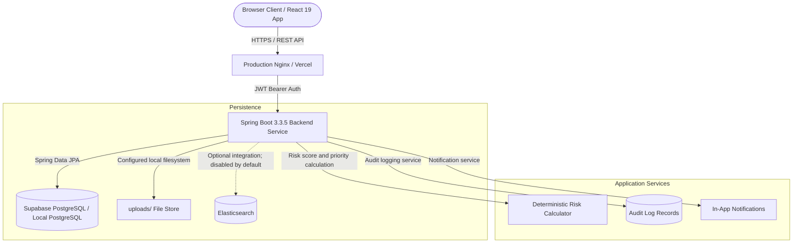

# 🛡️ ThreatGuard - Threat Incident Management System (SOC Platform)

[](https://github.com/Pranav-0440/threat-incident-management/actions)
[](https://spring.io/projects/spring-boot)
[](https://www.oracle.com/java/)
[](https://react.dev/)
[](https://supabase.com/)
[](LICENSE)

**ThreatGuard** is a full-stack Security Operations Center (SOC) reference application for reporting, investigating, triaging, collaborating on, and resolving physical and cybersecurity incidents.

Built with a **Spring Boot 3.3** backend, **Supabase PostgreSQL** (with an optional local PostgreSQL container), and a responsive **React 19** dashboard. The current AI-labelled experiences are deterministic client-side helpers; they do not call an external LLM service.

---

## 📸 Enterprise Platform Highlights


---

## 🏛️ System Architecture



PostgreSQL is the backend system of record. The Docker Compose MongoDB service is retained as an optional development container but is not used by the current JPA persistence layer. Elasticsearch support is optional and its auto-configuration is disabled by default. Evidence files use the local filesystem path configured by `file.upload-dir` (default `uploads`); production deployments therefore require persistent/shared storage or an explicitly configured storage provider.

---

## Key Feature Modules

### 1. 🔒 Hardened Authentication & Role-Based Access Control (RBAC)
- **Role Selection Cards**: Register as a **SOC Analyst** or **Administrator** directly on the sign-up page.
- **First-User Bootstrap**: The first registered system account automatically receives `ROLE_SUPER_ADMIN`.
- **Effective Role Hierarchy**: A `ROLE_SUPER_ADMIN` account is treated as an administrator and analyst by the database-backed authority mapping; ordinary registration accepts only `ANALYST` or `ADMIN`.
- **Login Identifier**: Authentication accepts either the username or the registered email address.
- **Admin User Management Console (`/admin/users`)**: Dedicated admin control panel to view registered analyst accounts, manage roles (`ANALYST` / `ADMIN`), and review active assigned workloads.

### 2. 🕵️ Security Analyst Investigation Workspace
- **Tabbed Workspace (`IncidentDetailPage.jsx`)**:
  - **Overview**: High-level metadata, risk assessment score gauge (0-100), client-side executive summary preview, and 6-item interactive SOC investigation checklist.
  - **Timeline**: Vertical Jira-style chronological history rendering audit-log records.
  - **Comments**: Threaded investigation discussion box.
  - **Evidence Files**: Multi-media file manager supporting screenshots, log files, PDFs, audio/video.
- **Lifecycle Stepper**: Visual 5-step progress pipeline (`OPEN` → `INVESTIGATING` → `WAITING_EVIDENCE` → `RESOLVED` → `CLOSED`).

### 3. AI-Labelled Client Helpers
- **Floating Assistant (`AiCopilotWidget.jsx`)**: An authenticated client-side helper that fetches incidents and applies deterministic keyword rules for common investigation prompts.
- **Auto-Suggestion (`CreateIncidentPage.jsx`)**: A local keyword heuristic suggests severity, category, priority (`P1-P4`), and risk score; the user remains responsible for the submitted values.
- **Executive Summary Preview (`IncidentDetailPage.jsx`)**: Generates a deterministic client-side summary from incident fields. There is no external LLM or backend AI endpoint in the current implementation.

### 4. 📊 Dashboard Analytics & Interactive Workspaces
- **Clickable Dashboard KPI Cards**: Click "Open Incidents" or "Critical Alerts" on `DashboardPage.jsx` to open the workspace pre-filtered.
- **Visual Analytics**: Interactive Severity Breakdown Donut Charts and Lifecycle Pipeline Bar Charts.
- **"My Incidents" Workspace Tabs**: Sub-header tabs for *All Incidents*, *Assigned to Me*, *Reported by Me*, and *Resolved*.
- **Starred Saved Presets Bar**: 1-Click filter shortcuts (`★ P1 Critical`, `★ Assigned To Me`, `★ High Risk (>70)`, `★ Today's Incidents`).

### 5. 📄 Executive Reports & Data Exporter
- **1-Click PDF Report Generator**: Produces branded Executive Incident Summaries with risk gauges and incident metadata; any AI-labelled notes are client-side text, not external model output.
- **Bulk CSV Exporter**: Exports filtered incident tables into downloadable CSV spreadsheets.

### 6. Audit Logs & In-App Notifications
- **Audit Logging Service**: Records creation, status updates, assignments, checklist toggles, comments, and attachment uploads with actor metadata and timestamps. The current application does not provide audit-log mutation endpoints; database-level immutability is not claimed here.
- **Notification Center Drawer**: Real-time notification drawer in `Navbar.jsx` with unread counter badge and "Mark all read" capabilities.

---

## ⚖️ Risk Score & Priority Matrix Formula

ThreatGuard calculates a risk score from the submitted severity and category and assigns a priority during incident creation. The score is capped at 100; priority selection uses severity first and then risk thresholds. The table below documents classification logic, not an independently enforced SLA system:

$$\text{Risk Score} = \text{Severity Weight} + \text{Category Weight}$$

| Severity Factor | Points |
| :--- | :---: |
| **CRITICAL** | +50 |
| **HIGH** | +35 |
| **MEDIUM** | +20 |
| **LOW** | +10 |

| Category Factor | Points |
| :--- | :---: |
| **WORKPLACE_VIOLENCE** | +30 |
| **CYBER_THREAT** | +25 |
| **THREAT** | +20 |
| **SUSPICIOUS_ACTIVITY** | +15 |
| **PHYSICAL_SECURITY** | +15 |

### Priority & Target Response SLA Windows
| Priority | Severity / Risk Threshold | Target SLA Window |
| :--- | :--- | :---: |
| 🔴 **P1 - Critical** | Severity = CRITICAL or Risk Score $\ge 70$ | **4 Hours** |
| 🟠 **P2 - High** | Severity = HIGH or Risk Score $\ge 50$ | **8 Hours** |
| 🟡 **P3 - Medium** | Severity = MEDIUM or Risk Score $\ge 30$ | **24 Hours** |
| 🟢 **P4 - Low** | Severity = LOW or Risk Score $< 30$ | No backend response-time timer |

---

## 🔌 REST API Reference

### Authentication (`/api/v1/auth`)
| Method | Endpoint | Access | Description |
| :--- | :--- | :--- | :--- |
| `POST` | `/api/v1/auth/register` | Public | Registers a new user with selected role (`ANALYST` or `ADMIN`) |
| `POST` | `/api/v1/auth/login` | Public | Authenticates credentials against database and returns JWT token |
| `POST` | `/api/v1/auth/forgot-password` | Public | Requests a reset link using a username or email without revealing account existence |
| `POST` | `/api/v1/auth/reset-password` | Public | Applies a valid, unexpired, single-use reset token to a new BCrypt password |

### Password recovery configuration

Password reset delivery is disabled by default. To enable SMTP delivery, set `APP_PASSWORD_RESET_MAIL_ENABLED=true`, configure `SMTP_HOST`, `SMTP_PORT`, `SMTP_USERNAME`, `SMTP_PASSWORD`, and set `APP_PASSWORD_RESET_MAIL_FROM` and `APP_FRONTEND_BASE_URL` for the deployment. Reset tokens are generated with a cryptographically secure random source, stored only as SHA-256 hashes, expire after 15 minutes, and are marked used after a successful reset. The forgot-password response is intentionally generic to reduce account enumeration.

### Incidents (`/api/v1/incidents`)
| Method | Endpoint | Access | Description |
| :--- | :--- | :--- | :--- |
| `GET` | `/api/v1/incidents` | Authenticated | Legacy unpaged list of security incidents |
| `GET` | `/api/v1/incidents/{id}` | Authenticated | Get detailed incident by ID |
| `GET` | `/api/v1/incidents/{id}/related` | Authenticated | Get matching historical incidents |
| `GET` | `/api/v1/incidents/search?q=` | Authenticated | Full-text PostgreSQL native search |
| `GET` | `/api/v1/incidents/stats` | Authenticated | Get scoped dashboard counts and risk metrics |
| `GET` | `/api/v1/incidents/analytics` | Authenticated | Get server-derived scoped analytics metrics |
| `GET` | `/api/v1/incidents/page` | Authenticated | Get bounded, filtered, stably sorted incident pages |
| `POST` | `/api/v1/incidents` | Analyst, Admin | Create a new security incident |
| `PUT` | `/api/v1/incidents/{id}` | Analyst, Admin | Update incident details |
| `PATCH` | `/api/v1/incidents/{id}/status` | Admin, Super Admin | Update lifecycle status (`OPEN`, `INVESTIGATING`, etc.) |
| `PATCH` | `/api/v1/incidents/{id}/assign` | Admin, Super Admin | Assign analyst to incident |
| `PATCH` | `/api/v1/incidents/{id}/checklist/{itemId}/toggle` | Admin, Super Admin | Toggle investigation checklist item |
| `DELETE` | `/api/v1/incidents/{id}` | Admin, Super Admin | Delete incident record |

### Evidence (`/api/v1/attachments`)
| Method | Endpoint | Access | Description |
| :--- | :--- | :--- | :--- |
| `POST` | `/api/v1/attachments/upload/{incidentId}` | Authenticated | Store an incident attachment on the configured backend filesystem |
| `GET` | `/api/v1/attachments/incident/{incidentId}` | Authenticated | List attachments for an incident |
| `GET` | `/api/v1/attachments/files/{fileName}` | Authenticated | Stream an attachment by stored filename |
| `DELETE` | `/api/v1/attachments/{id}` | Authenticated | Delete an attachment record and local file |

### Comments (`/api/v1/incidents/{incidentId}/comments`)
| Method | Endpoint | Access | Description |
| :--- | :--- | :--- | :--- |
| `POST` | `/api/v1/incidents/{incidentId}/comments` | Authenticated | Add a comment using the authenticated user as author |
| `GET` | `/api/v1/incidents/{incidentId}/comments` | Authenticated | List incident comments |
| `DELETE` | `/api/v1/incidents/{incidentId}/comments/{commentId}` | Admin, Super Admin | Delete an incident comment subject to service authorization |

### Audit Logs (`/api/v1/audit-logs`)
| Method | Endpoint | Access | Description |
| :--- | :--- | :--- | :--- |
| `GET` | `/api/v1/audit-logs/incident/{incidentId}` | Authenticated | List logs associated with an incident |
| `GET` | `/api/v1/audit-logs` | Admin | List all audit logs |

### Notifications (`/api/v1/notifications`)
| Method | Endpoint | Access | Description |
| :--- | :--- | :--- | :--- |
| `GET` | `/api/v1/notifications` | Authenticated | List notifications for the authenticated user |
| `GET` | `/api/v1/notifications/unread-count` | Authenticated | Return the authenticated user’s unread count |
| `PATCH` | `/api/v1/notifications/{id}/read` | Authenticated | Mark one notification as read |
| `PATCH` | `/api/v1/notifications/read-all` | Authenticated | Mark all notifications as read |

### User Management (`/api/v1/users`)
| Method | Endpoint | Access | Description |
| :--- | :--- | :--- | :--- |
| `GET` | `/api/v1/users` | Admin, Super Admin | Get user workload summaries |
| `PATCH` | `/api/v1/users/{id}/role` | Admin, Super Admin | Update user role (`ANALYST` / `ADMIN`) |

---

## Deployment Caveats

The current evidence implementation stores files on the backend filesystem and returns API download routes. Set `file.upload-dir` to a persistent/shared volume in production; an ephemeral container filesystem is not suitable for durable evidence retention. The frontend AI-labelled features are local heuristics and templates, not a security-grade autonomous decision engine. Treat generated suggestions as advisory and verify them before taking incident-response action.

---

## 🛠️ Local Development & Database Setup Options

Contributors can choose between two flexible database options:

### Prerequisites
- **Java 21 JDK**
- **Maven 3.9+**
- **Node.js 22+**
- **Docker Desktop** *(Optional - for local container setup)*

---

### Option 1: Supabase Cloud Database (Zero Setup - Recommended)
1. Set database credentials in `backend/.env`:
   ```env
   SPRING_DATASOURCE_URL=jdbc:postgresql://aws-0-ap-south-1.pooler.supabase.com:6543/postgres?user=postgres.iqmubvaknlwogmyqcfbp
   SPRING_DATASOURCE_USERNAME=postgres.iqmubvaknlwogmyqcfbp
   SPRING_DATASOURCE_PASSWORD=your_supabase_password
   ```

---

### Option 2: Local Docker Container (PostgreSQL / MongoDB)
If you prefer running a local database container offline:

```bash
# Spin up local PostgreSQL 16 & Mongo 7 containers
docker compose up -d
```

Update `backend/.env` for local PostgreSQL:
```env
SPRING_DATASOURCE_URL=jdbc:postgresql://localhost:5432/postgres
SPRING_DATASOURCE_USERNAME=postgres
SPRING_DATASOURCE_PASSWORD=postgrespassword
```

---

### 🚀 Running the Application

1. **Start Backend Service (Spring Boot)**
   ```bash
   cd backend
   mvn spring-boot:run
   ```
   > The API server starts on `http://localhost:8080`.

2. **Start Frontend Dashboard (React + Vite)**
   ```bash
   cd frontend
   npm install
   npm run dev
   ```
   > The dashboard runs on `http://localhost:5173`.

---

## 🧪 Testing & CI/CD Pipeline

### Automated Backend Tests
```bash
cd backend
mvn test --batch-mode
```

### Frontend Code Quality Checks & Build Verification
```bash
cd frontend
npm run lint
npm run build
```

---

## 📄 License

Distributed under the **MIT License**. See `LICENSE` for details.
