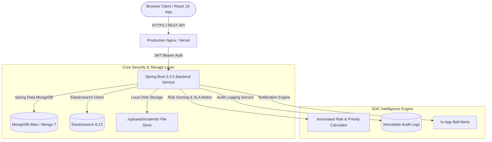

# 🛡️ ThreatGuard - Threat Incident Management System (SOC Platform)

[](https://github.com/Pranav-0440/threat-incident-management/actions)
[](https://spring.io/projects/spring-boot)
[](https://www.oracle.com/java/)
[](https://react.dev/)
[](https://www.mongodb.com/)
[](LICENSE)

**ThreatGuard** is a full-stack, enterprise-grade Security Operations Center (SOC) platform designed for Security Analysts, SOC Managers, and Administrators to report, investigate, triage, collaborate, and resolve physical and cybersecurity threats.

Built with a high-performance **Spring Boot 3.3** backend, **MongoDB Atlas**, **Elasticsearch**, and a responsive **React 19** dashboard frontend with interactive AI SOC Copilot intelligence.

---

## 📸 Enterprise Platform Highlights


---

## 🏛️ System Architecture



---

## 🚀 Key Feature Modules (Complete 10-Phase Roadmap)

### 1. 🔒 Hardened Authentication & Role-Based Access Control (RBAC)
- **Server-Side Security Enforcement**: Public self-registration **strictly enforces `ROLE_ANALYST` on the server**, completely ignoring client payloads attempting to request `ADMIN` permissions to prevent privilege escalation.
- **Initial Seed Setup**: The first registered system account automatically receives `ROLE_SUPER_ADMIN`.
- **Admin User Management Console (`/admin/users`)**: Dedicated admin control panel to view registered analyst accounts, manage roles (`ANALYST` / `ADMIN`), and review active assigned workloads (`activeAssigned` / `totalAssigned`).

### 2. 🕵️ Security Analyst Investigation Workspace
- **Tabbed Workspace (`IncidentDetailPage.jsx`)**:
  - **Overview**: High-level metadata, risk assessment score gauge (0-100), AI executive summary, and 6-item interactive SOC investigation checklist.
  - **Timeline**: Vertical Jira-style chronological history rendering immutable audit logs.
  - **Comments**: Threaded investigation discussion box.
  - **Evidence Files**: Multi-media file manager supporting screenshots, log files, PDFs, audio/video.
- **Lifecycle Stepper**: Visual 5-step progress pipeline (`OPEN` → `INVESTIGATING` → `WAITING_EVIDENCE` → `RESOLVED` → `CLOSED`).

### 3. 🤖 AI SOC Copilot & Intelligence Engine
- **Floating AI Assistant (`AiCopilotWidget.jsx`)**: Global persistent floating chat widget answering queries such as *"What is highest priority?"*, *"Summarize today's threats"*, *"Recommend mitigation actions"*.
- **AI Auto-Classification (`CreateIncidentPage.jsx`)**: Auto-suggests severity, threat category, priority (`P1-P4`), and initial risk score.
- **AI Executive Summarizer**: 1-click generation of concise executive summaries from detailed descriptions and evidence logs.

### 4. 📊 Dashboard Analytics & Interactive Workspaces
- **Clickable Dashboard KPI Cards**: Click "Open Incidents" or "Critical Alerts" on `DashboardPage.jsx` to open the workspace pre-filtered.
- **Visual Analytics**: Interactive Severity Breakdown Donut Charts and Lifecycle Pipeline Bar Charts.
- **"My Incidents" Workspace Tabs**: Sub-header tabs for *All Incidents*, *Assigned to Me*, *Reported by Me*, and *Resolved*.
- **Starred Saved Presets Bar**: 1-Click filter shortcuts (`★ P1 Critical`, `★ Assigned To Me`, `★ High Risk (>70)`, `★ Today's Incidents`).

### 5. 📄 Executive Reports & Data Exporter
- **1-Click PDF Report Generator**: Produces branded Executive Incident Summaries with risk gauges, metadata, and AI notes.
- **Bulk CSV Exporter**: Exports filtered incident tables into downloadable CSV spreadsheets.

### 6. 📜 Immutable Audit Logs & In-App Notifications
- **Audit Logging Service**: Automatically records every creation, status update, assignment, checklist toggle, comment, and attachment upload with author name and timestamp.
- **Notification Center Drawer**: Real-time notification drawer in `Navbar.jsx` with unread counter badge and "Mark all read" capabilities.

---

## ⚖️ Risk Score & Priority Matrix Formula

ThreatGuard calculates a dynamic Risk Score ($0 - 100$) and assigns a Priority level ($P1 - P4$) upon incident creation:

$$\text{Risk Score} = \text{Severity Weight} + \text{Category Weight}$$

| Severity Factor | Points |
| :--- | :---: |
| **CRITICAL** | +50 |
| **HIGH** | +35 |
| **MEDIUM** | +20 |
| **LOW** | +10 |

| Category Factor | Points |
| :--- | :---: |
| **WORKPLACE_VIOLENCE** | +30 |
| **CYBER_THREAT** | +25 |
| **THREAT** | +20 |
| **SUSPICIOUS_ACTIVITY** | +15 |
| **PHYSICAL_SECURITY** | +15 |

### Priority & Target Response SLA Windows
| Priority | Severity / Risk Threshold | Target SLA Window |
| :--- | :--- | :---: |
| 🔴 **P1 - Critical** | Severity = CRITICAL or Risk Score $\ge 70$ | **4 Hours** |
| 🟠 **P2 - High** | Severity = HIGH or Risk Score $\ge 50$ | **8 Hours** |
| 🟡 **P3 - Medium** | Severity = MEDIUM or Risk Score $\ge 30$ | **24 Hours** |
| 🟢 **P4 - Low** | Severity = LOW or Risk Score $< 30$ | **48 Hours** |

---

## 🔌 REST API Reference

### Authentication (`/api/v1/auth`)
| Method | Endpoint | Access | Description |
| :--- | :--- | :--- | :--- |
| `POST` | `/api/v1/auth/register` | Public | Registers a new user (Enforces `ROLE_ANALYST`) |
| `POST` | `/api/v1/auth/login` | Public | Authenticates credentials and returns JWT Bearer token |

### Incidents (`/api/v1/incidents`)
| Method | Endpoint | Access | Description |
| :--- | :--- | :--- | :--- |
| `GET` | `/api/v1/incidents` | Authenticated | List all security incidents |
| `GET` | `/api/v1/incidents/{id}` | Authenticated | Get detailed incident by ID |
| `GET` | `/api/v1/incidents/{id}/related` | Authenticated | Get matching historical incidents |
| `GET` | `/api/v1/incidents/search?q=` | Authenticated | Full-text syntax search (`severity:critical status:open`) |
| `GET` | `/api/v1/incidents/stats` | Authenticated | Get dashboard KPI statistics and risk metrics |
| `POST` | `/api/v1/incidents` | Analyst, Admin | Create a new security incident |
| `PUT` | `/api/v1/incidents/{id}` | Analyst, Admin | Update incident details |
| `PATCH` | `/api/v1/incidents/{id}/status` | Analyst, Admin | Update lifecycle status (`OPEN`, `INVESTIGATING`, etc.) |
| `PATCH` | `/api/v1/incidents/{id}/assign` | Analyst, Admin | Assign analyst to incident |
| `PATCH` | `/api/v1/incidents/{id}/checklist/{itemId}/toggle` | Analyst, Admin | Toggle investigation checklist item |
| `DELETE` | `/api/v1/incidents/{id}` | Admin | Delete incident record |

### User Management (`/api/v1/users`)
| Method | Endpoint | Access | Description |
| :--- | :--- | :--- | :--- |
| `GET` | `/api/v1/users` | Authenticated | Get all users with assigned workload stats |
| `PATCH` | `/api/v1/users/{id}/role` | Admin | Update user role (`ANALYST` / `ADMIN`) |

---

## 🛠️ Local Development & Quick Start

### Prerequisites
- **Java 21 JDK**
- **Maven 3.9+**
- **Node.js 20+**
- **Docker Desktop**

### 1. Clone & Start Infrastructure
```bash
git clone https://github.com/Pranav-0440/threat-incident-management.git
cd threat-incident-management

# Start MongoDB 7 & Elasticsearch 8 containers
docker compose up -d
```

### 2. Start Backend Service (Spring Boot)
```bash
cd backend
mvn spring-boot:run
```
> The API server starts on `http://localhost:8080` (API Base: `http://localhost:8080/api/v1`).

### 3. Start Frontend Dashboard (React + Vite)
```bash
cd frontend
npm install
npm run dev
```
> The frontend dashboard runs on `http://localhost:5173`.

---

## 🧪 Testing & CI/CD Pipeline

### Automated Backend Tests
```bash
cd backend
mvn test --batch-mode
```

### Frontend Code Quality Checks & Build Verification
```bash
cd frontend
npm run lint
npm run build
```

---

## 📄 License

Distributed under the **MIT License**. See `LICENSE` for details.
